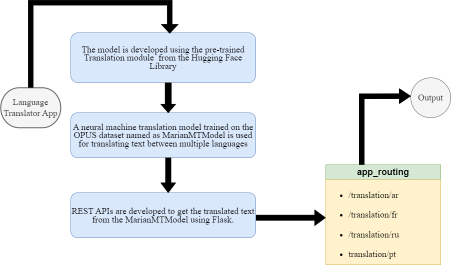

# Language Translator model
### This is a language translation application developed during the proposal submission round of GSOC 2024 for the  organization City of Boston. The project idea has been taken from the list of ideas of the organization itself. ###
## Working ##
This application uses MarianMTModel which is a family of neural machine translation models trained on the OPUS dataset. This model is designed for translating text between multiple languages. Further model is  accessed through REST APIs developed using Flask.  

### This model can translate the below language. ### 

<li></li>
 
 

### <b>•</b>Application is trained with the _Helsinki-NLP/opus-mt-en-{target_language}_ model. ###
### <b>•</b>{target_language} will be replaced by the language code. ###
### <b>•</b>The Below image represents the language code for different languages. ### 
<li></li>

### <b>•</b>Once the model is trained,rest-APIs will serve translated text as a response. ###

 
 

### Below is the flow diagram of the application. ###

<li></li>

 
 

## To test this model, copied the description of one pothole reporting from the 311 app, and passed it as the request body of RESTAPIs, below are the responses in different languages. ##

### Curl for Arabic translation ###

    curl --location --request GET 'http://127.0.0.1:5000/translation/ar' \
    --header 'Content-Type: text/plain' \
    --data '"close to the mbta station | Where exactly on the pavement is the pothole: [On Roadway] What is the approximate size of the pothole: [2ft] Date when pothole noticed: [03/31/2024] Time when pothole noticed: [10:09]"

### Response in Arabic ###

    "Language - arabic  \"على مقربة من محطة Mbta حيث بالضبط على الرصيف هو حفرة الفتحة: [على الطريق] ما هو الحجم التقريبي للحفرة: [[ft] التاريخ الذي لاحظت فيه الحفرة: [03/31/2024]"
### Curl for French translation ###

    curl --location --request GET 'http://127.0.0.1:5000/translation/fr' \
    --header 'Content-Type: text/plain' \
    --data '"close to the mbta station | Where exactly on the pavement is the pothole: [On Roadway] What is the approximate size of the pothole: [2ft] Date when pothole noticed: [03/31/2024] Time when pothole noticed: [10:09]"
    
    
### Response in French ###

    "Language - french  \"à proximité de la station de mbta\" Où exactement sur le pavement est le trou de pot: [Sur la route] Quelle est la taille approximative du trou de pot: [2ft] Date où le trou de pot"
### Curl for Russian translation ###

    curl --location --request GET 'http://127.0.0.1:5000/translation/ru' \
    --header 'Content-Type: text/plain' \
    --data '"close to the mbta station | Where exactly on the pavement is the pothole: [On Roadway] What is the approximate size of the pothole: [2ft] Date when pothole noticed: [03/31/2024] Time when pothole noticed: [10:09]"

### Response in Russian ###

    "Language - russian  \"Близко к станции mbta, где именно на тротуаре находится выбоина: [На дороге] Как приблизительно размер выбоины: [2 фута] Дата, когда выбоина заметила:"

### Limitation ###
**This model needs to be tested with a wide range of requests, reported on 311-app to achieve smooth translation on corner-edge cases.**  
    

    

